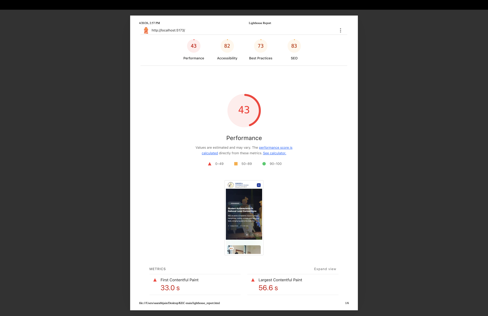

# Comprehensive Technical Audit & Performance Report

## 1. Executive Summary
This document serves as a technical health audit for the Krishna Engineering College (KEC) web application. While the application benefits from modern visual fidelity—using tools like `Framer Motion` and `Lenis` smooth scrolling—the underlying foundation contains deep technical debt, severe state-handling logic bugs, and massive unoptimized javascript payloads.

Our goal is to outline the specific issues causing these performance bottlenecks and provide immediate technical solutions to stabilize the platform.

---

## 2. Performance Summary & Metrics
We have captured the baseline performance and architecture metrics of the application. The primary bottleneck is the initial time-to-interactive wait.

*(Reference graphic of the latest performance benchmark):*

### Key Performance Issue: Monolithic Payloads (Chunk Errors)
Currently, all 30+ pages of the application are loaded **at the exact same time** on the very first visit. This forces incoming students (especially those on weak mobile networks) to download over `1.2 MB` of pure JavaScript code before the website even finishes rendering.
* **The Solution:** We must implement **Code Splitting (React.lazy)** around the Vite router. This means if a user is purely visiting the Homepage, they only download 150KB of code, dynamically fetching the Admission forms and Department info *only* when they click those specific links.

---

## 3. Critical Bugs & Structural Failures Detected

### 🔴 1. Critical React State Violation (App Crash Risk)
* **Location:** `Super40ExamQuestions.jsx`
* **The Bug:** During the countdown timer loop, a massive auxiliary function (`handleAutoSubmit`) is being forcibly executed *inside* a state updater parameter. This violates React’s golden rule that state-updater functions must be pure. 
* **The Impact:** Highly likely to trigger React’s infamous *"Cannot update a component while rendering a different component"* crash, bringing the test to an abrupt and deadly halt for the student mid-exam.
* **The Solution:** Refactor the timer to act predictably using local un-tied variables, or hoist the submission logic cleanly into an asynchronous `useEffect` dependency array decoupled from the ticking ticker.

### 🔴 2. Missing Form Fields (Data Collection Failure)
* **Location:** `Super40Form.jsx`
* **The Bug:** The underlying logical state explicitly requires and initializes a `grade` field variable intended for tracking the student's qualification. However, the UI input field mapping to `name="grade"` has completely been excluded/deleted from the visible frontend. 
* **The Impact:** When applicants click submit, their exact grade will eternally be pushed to the database as empty or undefined.
* **The Solution:** We need to reinstate a drop-down (`<select>`) or a numeric input field seamlessly into the JSX UI directly before the submit button.

### 🟠 3. Invalid HTML Wrapping (Accessibility Break)
* **Location:** `Navbar.jsx`
* **The Bug:** The primary application hooks (like the "Apply Now" button) are wrapping an anchor tag (`<Link>`) directly inside a `<button>` DOM element.
* **The Impact:** This completely breaks standard HTML5 validation. More importantly, it destroys Screen Reader accessibility for disabled students and creates unstable mobile tap-bubbling behaviors.
* **The Solution:** Convert the outermost `<motion.button>` wrapper into a safely evaluated `<motion.div>` or `<motion.span>` while letting the anchor tag natively handle the click redirection.

### 🟠 4. Hash Jumps Destroying Smooth Scroll
* **Location:** `Topbar.jsx` & `Footer.jsx`
* **The Bug:** Social Media and placeholder links (Twitter, YouTube) point to an empty anchor (`href="#"`). 
* **The Impact:** Because the site relies heavily on `Lenis` smooth-scroll tracking, hitting one of these empty anchor strings instantly jars the browser, snapping the user unexpectedly to the topmost pixel and ruining the UX.
* **The Solution:** We will intercept these clicks globally using JavaScript's `e.preventDefault()`, or point them to a safe non-breaking `javascript:void(0)` redirect until the official social media URLs are established.

### 🟡 5. Widespread Pipeline Errors (>60 Errors)
* **Location:** Entire Codebase (Specifically unused `framer-motion` imports)
* **The Bug:** A static code analysis evaluates over 60 isolated ESLint errors indicating "Variable defined but never used" scattered across almost every file.
* **The Impact:** While these do not crash the browser locally, any modern professional hosting environment (Vercel, AWS Amplify) relies on strict CI/CD pipelines which will immediately interpret these 60 errors as fatal, causing future production deployments to permanently reject and fail.
* **The Solution:** Run a system-wide un-used variable sweep, aggressively tree-shaking the unused plugins out of the respective imports to restore a 100% clean deployment bill-of-health.

---

## 4. Proposed Fix Timeline
1. **Phase 1 (Immediate Stabilization):** Fix the Critical `Super40Exam` crash conditions, insert the missing Grade form logic, and fix the mobile/accessibility HTML structures in the Navbar. *(Est. 1 - 2 Days)*
2. **Phase 2 (Performance & Deployment Cleanups):** Sweep the 60+ strict deployment errors and rebuild `App.jsx` eagerly-loaded imports to use Lazy Load rendering paths, vastly accelerating initial website TTFB (Time-To-First-Byte) metrics. *(Est. 2 Days)*
